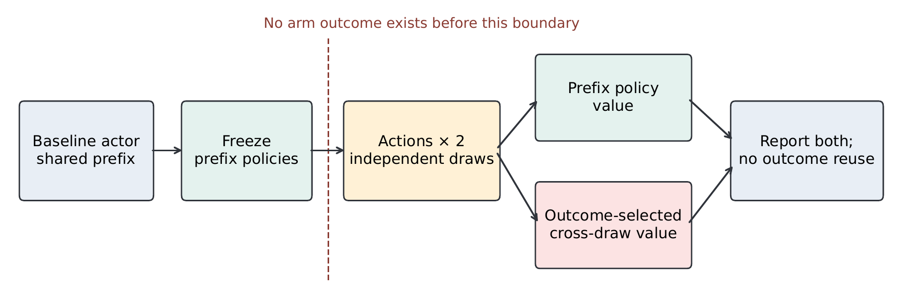
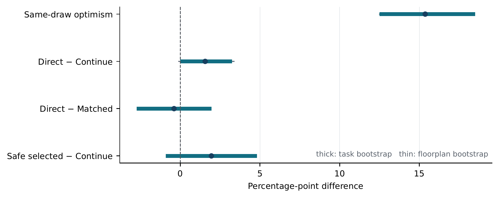

# Intervene or Continue

Minimal reproducibility package for **Selection Is Not Evaluation: Independent Continuations for Runtime Intervention in Language Agents**.

- [Paper PDF](paper/paper.pdf)
- [LaTeX source](paper/paper.tex)
- [Reproducibility guide](REPRODUCIBILITY.md)

## Method

*Freeze the policy before intervention outcomes exist, generate independently seeded continuations from the same prefix, and score outcome-selected actions on the other draw. The split separates the value of the decision from favorable branch noise.*

## Results

Intervene or Continue separates two decisions that same-branch evaluation conflates: which intervention to select and which continuation to use to measure its value. Across 384 planned ALFWorld tasks, same-draw maximization exceeds independent-draw evaluation by **15.36 percentage points** (group-bootstrap 95% interval [12.46, 18.30]). This is a selection-optimism diagnostic; it does not establish that intervention improves success.

*Selection optimism and deployable controller effects on the first confirmation panel. Thick intervals resample tasks; thin intervals resample floorplan groups. Direct control changes success by +1.56 points against continuation and −0.39 points against the matched controller; both intervals include zero.*

The second confirmation moves the decision to a public failure signal and separates repair depth from repair content. On 593 planned tasks, cross-draw control reaches 56.24% success, **+1.26 points** over continuation (group-bootstrap 95% interval [−0.35, 2.83]) and +1.94 points over the best fixed repair [−0.17, 4.17]. These intervals include zero. The scheduled-rule refit reported in the appendix was fitted after that panel's outcomes and remains exploratory.

The practical result is simple: retain the option to continue, freeze the controller before outcomes, and separate selection from evaluation with independent continuations. Claims remain limited to the evaluated settings; the appendix and [archived protocols](https://github.com/mariklolik/intervene-or-continue-iclr2027/tree/archive/reproduction-full-2026-10-04/protocol) preserve the complete ScienceWorld boundary and post-review evidence.

## Repository map

| Path | Contents |
|---|---|
| controller/cross_draw.py | Cross-draw action selection and independent-draw valuation |
| controller/direct_advantage.py | Signed-benefit learner with continuation as the reference |
| controller/ | Fitting, prediction freezing, confirmation evaluation, and core tests |
| extension/ | Shared action contract, prefix features, grouped folds, and record validation |
| data/first-study/ | Downloaded raw records, configurations, and frozen predictions (ignored) |
| records/ | Regenerated confirmation statistics (ignored) |
| paper/ | Self-contained LaTeX source and compiled PDF |
| [Research archive](https://github.com/mariklolik/intervene-or-continue-iclr2027/tree/archive/reproduction-full-2026-10-04) | Frozen protocols, full runtime, generators, audits, and post-review evidence |

## Quick verification

see [REPRODUCIBILITY.md](REPRODUCIBILITY.md).

## Main paper pipeline

    make artifacts
    make evaluate
    make test

The default commands reproduce the first confirmation statistics from the published raw records and frozen predictions. The second study's frozen reports, controller freezes, capacity probes, temperature ablation, scheduled-rule refits, and complete experiment pipeline remain in the [complete reproduction archive](https://github.com/mariklolik/intervene-or-continue-iclr2027/tree/archive/reproduction-full-2026-10-04). New rollouts require the archived simulator and inference environment; the public supplement predates the second study.

## Artifact integrity

The raw-record supplement is checked against its published SHA-256 before extraction. Paper input and output hashes are recorded in the [archived first-study manifest](https://github.com/mariklolik/intervene-or-continue-iclr2027/blob/archive/reproduction-full-2026-10-04/paper/generated/manifest.json) and [second-study manifest](https://github.com/mariklolik/intervene-or-continue-iclr2027/blob/archive/reproduction-full-2026-10-04/paper/generated/r2_manifest.json). The public repository contains no actor weights, credentials, or private data.
